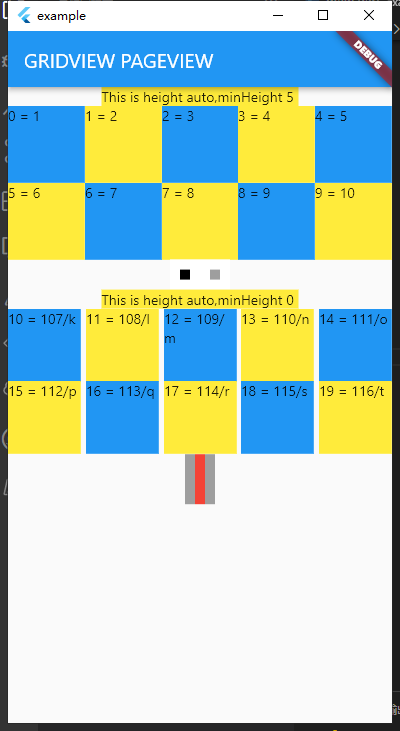

# grid pageview

Automatically wrap the content, produce the height according to the content, and support page turning custom indicator


Pageview is unable to adapt to the height of the content, and this control solves this problem, the effect of this control as shown in the picture, support to set the minimum height, in order to solve the problem of the height of each page caused by different height, in addition to support custom indicators,  
pageview 是无法自适应内容高度的，而本控件解决了这个问题，本控件的效果如 图片所示，支持设置最小高度，以便解决每一页高度不同导致的高度跳动问题，另外也支持自定义指示器，
## Getting Started

```


    GridPageView(
                column: 5,
                minheight: 0,
                row: 2,
                columnSpacing: 5,
                indicatorBuild: (controller, focused, index) {
                  return GestureDetector(
                      onTap: () {
                        // setState(() {
                        //           _currentPage = i;
                        //         });

                        controller.animateToPage(index,
                            duration: const Duration(milliseconds: 200),
                            curve: Curves.linear);
                      },
                      child: Container(
                          padding: const EdgeInsets.all(5),
                          height: 50,
                          color: focused ? Colors.red : Colors.grey));
                },
                children: 'abcdefghijklmnopqrstuvwxyz'
                    .codeUnits
                    .asMap()
                    .entries
                    .map((e) {
                  return Container(
                      color: e.key % 2 == 0 ? Colors.blue : Colors.yellow,
                      height: 30,
                      child: Text(
                          "${e.key} = ${e.value}/${String.fromCharCodes([
                            e.value
                          ])}"));
                }).toList())

                

```


or 

If you don't need custom indicators, you can do so using the following code  
```

  GridPageView(
                column: 5,
                minheight: 5,
                row: 2,
                children: [1, 2, 3, 4, 5, 6, 7, 8, 9, 10, 11, 12, 13, 14, 15]
                    .asMap()
                    .entries
                    .map((e) {
                  return Container(
                      color: e.key % 2 == 0 ? Colors.blue : Colors.yellow,
                      height: 30,
                      child: Text("${e.key} = ${e.value}"));
                }).toList())


 ```               

 


 # publish note


 ```
 发布插件的问题
set https_proxy=https://127.0.0.1:1080


这个设置http代理可以不设置，如果命令行可以ping通google.com 或者pub.dartlang.org

 flutter pub publish --dry-run -v #检测发布是否满足需求
 flutter packages pub publish -v 
flutter pub publish --server=https://pub.dartlang.org  -v
flutter packages pub publish --server=https://pub.dartlang.org  -v
set HTTP_PROXY=127.0.0.1:1080
set HTpingTPS_PROXY=127.0.0.1:1080
flutter pub publish --dry
 
 
 -run --server=https://pub.dartlang.org
flutter packages pub publish --server=https://pub.flutter-io.cn -v
[comment]: <> (https://pub.dartlang.org/api/packages/expandable_page_view)
由于使用到了第三方插件，但是又开启了防火墙，这个根本搞不过来，打开了输出日志，然后不断切换vpn浏览器能打开了，这边也没再提示重试了。。

dart pub publish
unset FLUTTER_STORAGE_BASE_URL; 这个在window没用，直接设定--server或者设置为空应该就行了
unset PUB_HOSTED_URL
 
 主要搞不懂为啥发布了那么久，反反复复的重复，都是因为用了第三方的插件导致？？
 ```